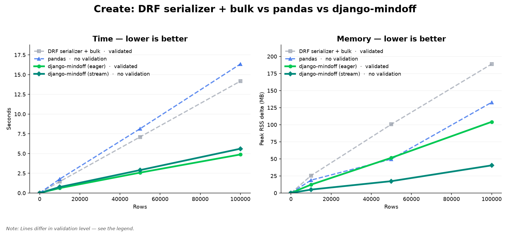
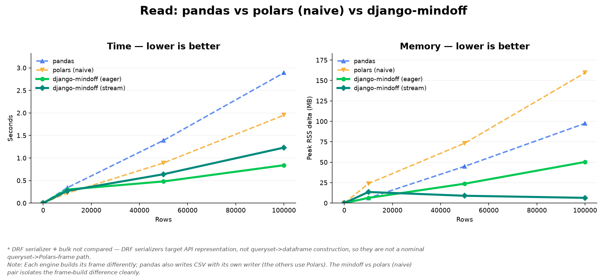
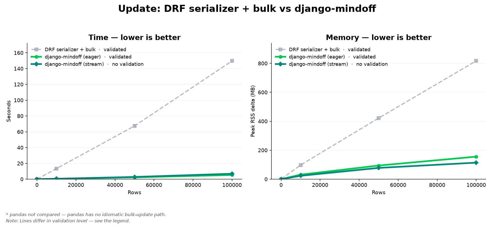

# Django Mindoff — Example & Benchmark

[](https://github.com/mindoffwork/django-mindoff-benchmark/actions/workflows/ci.yml)
[](https://github.com/mindoffwork/django-mindoff-benchmark/actions/workflows/ci.yml)
[](LICENSE)
[](https://pypi.org/project/django-mindoff/)

A small, runnable Django project that shows what [django-mindoff](https://github.com/mindoffwork/django-mindoff)
actually does — and a benchmark that measures it against plain Django REST Framework,
pandas, and naive Polars so you can check the claims yourself instead of taking them on faith.

It's intentionally tiny. Clone it, run it, call a few endpoints, open a couple of files,
and you should have a fair read on whether the framework is worth your time — in about ten minutes.

> **Not a starter template.** This repo optimizes for *showing* and *measuring*, not for
> being the scaffold you build a product on. For that, install the framework and run
> `django-mindoff init`.

---

## TL;DR — the benchmark

The headline question is simple: for bulk tabular work over a Django model, how does
django-mindoff compare to the usual tools? Here are the median results at **100,000 rows**
on the default local SQLite database (5 measured iterations after a warmup):

| Operation | DRF serializer `many=True` | pandas | django-mindoff | Mindoff speedup |
| --- | --- | --- | --- | --- |
| **Create** (validated) | 14.17 s · 189 MB | 16.34 s · 133 MB | **4.88 s · 104 MB** | **~2.9× faster** |
| **Read** (queryset → frame → CSV) | — *(not a frame path)* | 2.89 s · 98 MB | **0.84 s · 50 MB** | **~3.4× faster** |
| **Update** (validated) | 149.70 s · 817 MB | — *(no bulk-update path)* | **5.30 s · 155 MB** | **~28× faster** |

The "django-mindoff" column above is the eager, **fully validated** write path — it does
the same model-aware validation a DRF serializer does, just vectorized. A streaming
(validation-skipped) lane is also measured and is the memory champion (e.g. read at 100k
peaks at **~6 MB** instead of holding the result set in RAM).

Charts and the full table (10k / 50k / 100k) are committed under [benchmarks/](benchmarks/) and
regenerated on every run — see [Reproduce the benchmark](#reproduce-the-benchmark).

> **Version this benchmark ran on: `django-mindoff` 0.6.0** (pinned in
> [requirements.txt](requirements.txt)). Every time a new `django-mindoff` is released we
> bump that pin, re-run the benchmark, and refresh the artifacts in `benchmarks/` — so the
> numbers above always reflect a specific, reproducible framework version rather than
> "whatever was latest."

| Create | Read | Update |
| --- | --- | --- |
|  |  |  |

A fair-play note up front: at small batch sizes plain Django often wins, because Mindoff
pays a fixed setup cost to build frames and run vectorized validation. The framework is a
complement for **bulk** tabular workloads, not a replacement for the ORM. The benchmark is
built to show both sides of that honestly.

---

## What's in here

Each feature maps to a file you can open. That's the point — read the code, not a brochure.

| You want to see… | Look at | Endpoint |
| --- | --- | --- |
| A managed API + response envelope | [apps/shop/apis/get_profile.py](apps/shop/apis/get_profile.py) | `GET /v1/shop/get_profile/` |
| Payload validation + versioning (same route, two versions) | [apps/shop/apis/create_order.py](apps/shop/apis/create_order.py) | `POST /v1/shop/create_order/`, `POST /v2/shop/create_order/` |
| Bulk row validation (accept good rows, reject bad ones) | [apps/catalog/apis/import_products.py](apps/catalog/apis/import_products.py) | `POST /v1/catalog/import_products/` |
| Queryset → Polars frame → aggregation, no row loop | [apps/catalog/apis/list_products_report.py](apps/catalog/apis/list_products_report.py) | `GET /v1/catalog/list_products_report/` |
| The create/read/update benchmark | [apps/catalog/components/products.py](apps/catalog/components/products.py) | `POST /v1/catalog/run_product_benchmark/` |
| Queue-mode API (`process_mode = "queue"`) | [apps/jobs/apis/generate_inventory_report.py](apps/jobs/apis/generate_inventory_report.py) | `POST /v1/jobs/generate_inventory_report/` |

Every API and component file carries a docstring explaining what it does and why, so the
README doesn't repeat them. Start at a `components/` file (e.g.
[apps/catalog/components/products.py](apps/catalog/components/products.py)) to follow the flow.

---

## Quick start

Requires **Python 3.12 or 3.13**.

```bash
# 1. Clone
git clone https://github.com/mindoffwork/django-mindoff-benchmark.git
cd django-mindoff-benchmark

# 2. (recommended) virtual environment
python -m venv .venv
source .venv/bin/activate        # Windows: .venv\Scripts\activate

# 3. Install — pulls django-mindoff[internal] (DRF, Polars, ConnectorX, ...) + chart deps
pip install -r requirements.txt

# 4. Environment file — settings need a secret key and REDIS_URL to import
cp .env.example .env

# 5. Database + run
python manage.py migrate
python manage.py runserver
```

Open http://127.0.0.1:8000 for the landing page, then hit the endpoints below or import
the Postman collection.

> **Heads up on `DEBUG`.** Settings parse `DEBUG` from `.env`. If your shell *also* exports
> a global `DEBUG` variable, python-decouple may read that instead — keep it boolean-ish:
>
> ```powershell
> $env:DEBUG="True"
> ```

---

## Try the endpoints

The lowest-friction path is Postman: import
[django-mindoff-showcase.postman_collection.json](django-mindoff-showcase.postman_collection.json)
(it ships a `base_url` variable pointed at `http://127.0.0.1:8000` and every request below).
If you prefer the terminal:

### Shop — managed APIs, responses, validation, versioning

```bash
curl http://127.0.0.1:8000/v1/shop/get_profile/

curl -X POST http://127.0.0.1:8000/v1/shop/create_order/ \
  -H "Content-Type: application/json" \
  -d '{"customer_name":"Asha","customer_email":"asha@example.com","product_name":"Wireless Mouse","quantity":2}'

# same route, richer v2 response
curl -X POST http://127.0.0.1:8000/v2/shop/create_order/ \
  -H "Content-Type: application/json" \
  -d '{"customer_name":"Asha","customer_email":"asha@example.com","product_name":"Mechanical Keyboard","quantity":1}'
```

### Catalog — bulk data and reporting

```bash
# one valid row, one intentionally invalid row (empty sku, negative price)
curl -X POST http://127.0.0.1:8000/v1/catalog/import_products/ \
  -H "Content-Type: application/json" \
  -d '{"rows":[{"sku":"SKU-001","name":"Keyboard","price":49.99,"stock":20,"category":"accessories"},{"sku":"","name":"Bad Product","price":-10,"stock":5,"category":"misc"}]}'

curl http://127.0.0.1:8000/v1/catalog/list_products_report/
```

### Jobs — optional queue mode

Only this endpoint needs Redis. Skip it and everything else still works.

```bash
redis-server
dramatiq django_mindoff.queue_worker
curl -X POST http://127.0.0.1:8000/v1/jobs/generate_inventory_report/ \
  -H "Content-Type: application/json" \
  -d '{"report_name":"weekly_inventory_snapshot"}'
```

---

## Reproduce the benchmark

This is the part meant to survive a skeptical read. Everything below is implemented in
[apps/catalog/components/](apps/catalog/components/) — `config.py` is the methodology in
constants, `measure.py` is how every number is taken.

### Run it

```bash
curl -X POST http://127.0.0.1:8000/v1/catalog/run_product_benchmark/ \
  -H "Content-Type: application/json" \
  -d '{"row_count":[10000,50000,100000],"iterations":5}'
```

That writes, under `output/`:

- `catalog_benchmark_values.csv` — every measured number, plus a `remarks` column that
  records each deliberately-skipped comparison and why.
- `catalog_benchmark_create.png`, `catalog_benchmark_read.png`, `catalog_benchmark_update.png`
  — one file per operation, each with a time panel and a memory panel.

The published copies in [benchmarks/](benchmarks/) were generated with exactly the command
above, against the `django-mindoff` version pinned in [requirements.txt](requirements.txt)
(currently **0.6.0**). To refresh them — which we do on every new `django-mindoff` release —
bump the pin, re-run, and copy the four files from `output/` over the ones in `benchmarks/`,
updating the version note in this README in the same change.

### What's actually being compared

Each operation is judged on **both time and memory** against every method that has a
genuine workflow for it. Methods with no idiomatic path for an operation are skipped and
called out (`*` footnote on the chart, a dedicated `remarks` row in the CSV):

- **Create** — DRF `Serializer(data=rows, many=True).save()` vs pandas vs django-mindoff.
- **Read** — queryset → dataframe → CSV: pandas (`from_records`), naive Polars
  (`pl.DataFrame(list(qs))`), and django-mindoff (ConnectorX eager / streaming). DRF sits
  out — serializers target API representation, not dataframe construction.
- **Update** — DRF `Serializer(..., many=True, partial=True).save()` vs django-mindoff.
  pandas sits out — it has no idiomatic bulk-update path.

### How the numbers are taken

- **Source shape is realistic.** Bulk rows come from a Parquet file, so each engine
  ingests data the way it actually would — not from hand-built Python objects, which would
  unfairly tax some engines with construction overhead.
- **Time** is the **median** of at least **5 measured iterations** after **1 warmup**.
- **Memory** is **peak RSS delta**, sampled in a separate isolated worker process per
  lane — so native Polars/Arrow allocations are counted, without noise from the
  long-running API process.
- **Validation is disclosed per line.** The eager Mindoff and DRF create/update lines run
  **full** model-aware validation; the streaming Mindoff and pandas lines skip it. The
  chart legend and the CSV `remarks` column say which is which, so you never compare a
  validated path against an unvalidated one without knowing.
- **Query count is diagnostic only.** Mindoff's bulk writes can persist through a path
  Django's cursor instrumentation never sees, so a `0` there does **not** mean "no database
  work" — it's labelled as such in the output.
- **Read results are checked for parity** across engines (same rows out) before timings count.

### Make it a fair fight

The committed numbers are **local SQLite**, which is the worst case for showing Mindoff
off (single-writer, no native bulk-load path). For numbers that reflect production, point
the project at **PostgreSQL or MySQL** and push the row counts up:

```json
{ "row_count": [50000, 250000, 1000000], "iterations": 5 }
```

A file lock plus SQLite WAL/`busy_timeout` pragmas keep repeated local runs from colliding
on the shared demo database.

---

## Tests

```bash
pytest
```

Targeted examples:

```bash
pytest apps/shop/tests/test_apis/test_create_order.py -q
pytest apps/catalog/tests/test_apis/test_run_product_benchmark.py -q
```

CI runs the same suite on Python 3.12 and 3.13 for every PR and every push to the protected
branch — see [.github/workflows/ci.yml](.github/workflows/ci.yml).

---

## Project layout

```
apps/
  shop/      managed APIs, response envelopes, payload validation, v1/v2 versioning
  catalog/   bulk import, Polars reporting, and the create/read/update benchmark
  jobs/      optional queue-mode API (Redis + Dramatiq)
config/      settings, root URLs, response-code registry (responses.csv)
benchmarks/  published benchmark artifacts (charts + CSV) — tracked in git
mindoff.py   the framework's project manager (scaffolding commands)
```

Each app follows the same shape: thin handlers in `apis/`, reusable logic in `components/`,
tests in `tests/`.

---

## Links

- **Framework**: https://github.com/mindoffwork/django-mindoff
- **Docs**: https://django.mindoff.work
- **PyPI**: https://pypi.org/project/django-mindoff/

## License & conduct

[BSD-3-Clause](LICENSE) — same license as django-mindoff itself. Please be decent: see the
[Code of Conduct](CODE_OF_CONDUCT.md). Contributions welcome — start with
[CONTRIBUTING.md](CONTRIBUTING.md). Found a vulnerability? See the
[Security Policy](SECURITY.md). Past changes live in the [Changelog](CHANGELOG.md).
